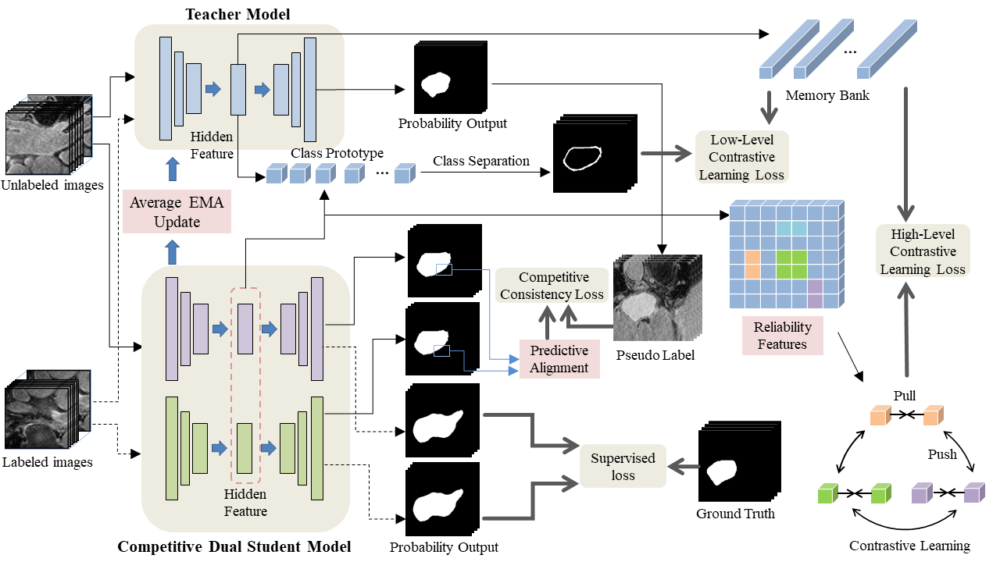
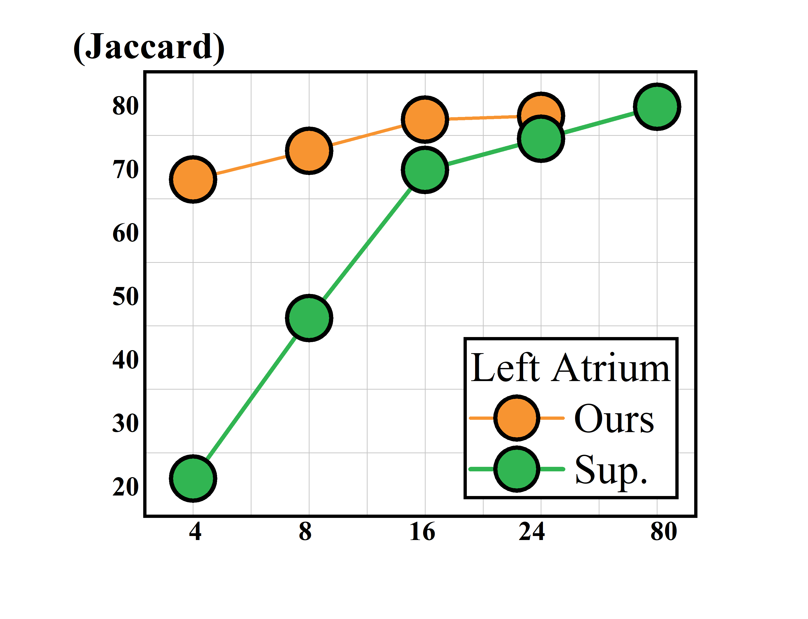
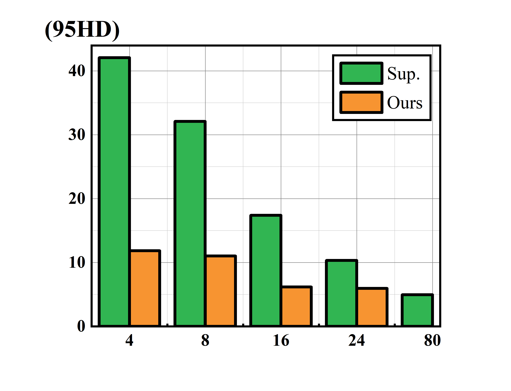

## Competitive dual-students using bi-level contrastive learning for semi-supervised medical image segmentation



## :credit_card: Dataset 

```
Shell
├── data
    ├── 2018LA_Seg_Training Set
        ├── 0RZDK210BSMWAA6467LU
            ├── mri_norm2.h5
            ...
    ├── test.list
    ├── train.list
```
## :notebook: Results


